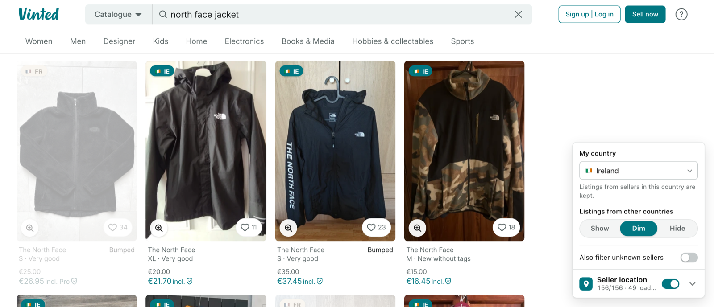
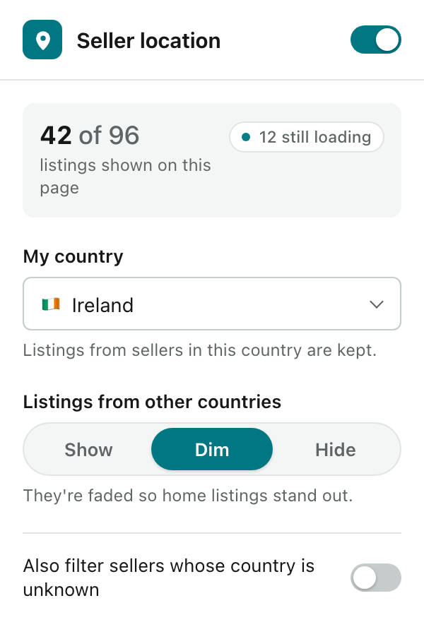
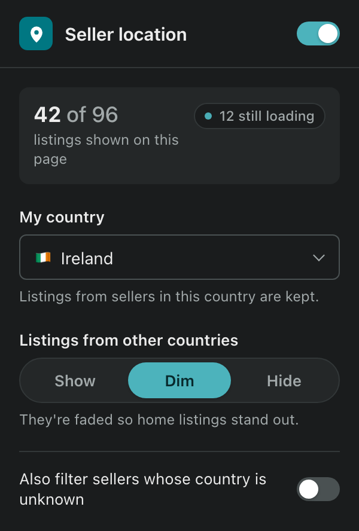

# Vinted Country Filter

Chrome/Edge/Brave extension that adds a country badge (e.g. `🇮🇪 IE`, `🇫🇷 FR`) to every
Vinted listing and lets you dim or hide items from sellers outside your country.

Not affiliated with, endorsed by, or connected to Vinted.

The toolbar popup follows your system's light or dark mode:

  
  &nbsp;
  

## Install (unpacked)
1. Download the latest `vinted-country-filter-<version>.zip` from
   [Releases](https://github.com/bgallagher/vinted-country-filter/releases) and unzip it, or clone
   this repo.
2. Open `chrome://extensions`, turn on **Developer mode**.
3. **Load unpacked** → select the unzipped folder (or the repo folder).
4. Open any Vinted search or the home page. A "Seller location" panel appears bottom-right; pick your country there.

## Using it
- **On/off switch** (in the panel header and the popup): turn the filter off to stop checking
  sellers and remove all badges and dimming. Turn it back on and everything returns, with sellers
  already looked up restored instantly from the cache.
- **My country**: the country whose sellers you want to keep. Defaults to the country of the
  Vinted site you're on (so `vinted.ie` → Ireland). Set it explicitly if you shop on another
  country's site, e.g. you live in Ireland but browse `vinted.fr`.
- **Other countries**: `Show (badge only)`, `Dim`, or `Hide` listings from sellers elsewhere.
- **Also filter unknown**: treat sellers whose country couldn't be read as "other".
- Hover a badge to see the seller's city (when they've made it public).
- **View photos**: click the magnifier in the bottom-left corner of a listing's photo to see all
  of its photos full size, without leaving the results. Use ← / → to step through them, and Esc to close.

The same settings open in a popup when you click the extension's toolbar button (pin it from
Chrome's puzzle-piece menu to keep it visible). On a Vinted search, the popup also shows how many
listings on the page are shown and how many are still loading. Changes apply to open Vinted tabs
right away.

Badges: teal = your country, amber = another country, pulsing `…` = still looking up the seller,
`? –` = the seller's country isn't available.

## How it works
Vinted's listings don't include seller location, only the seller's user ID.
- `inject.js` (page context) reads item → seller IDs from the server-rendered page and from
  the responses Vinted loads later (search pages, the home feed, seller promotion boxes, a
  listing's "Member's items" and "Similar items", profile wardrobes). It only reads responses
  and never changes them.
- `content.js` looks up each seller via `/api/v2/users/{id}` (`country_iso_code`), caches the
  result for 90 days in `chrome.storage.local`, and badges/filters the grid.

## Limits
- Vinted rate-limits user lookups to about 30 every 30 seconds. On a fresh search, the listings
  on screen get their badges within a few seconds; a full page of new sellers still takes a
  minute or two. Cached sellers show instantly.
- Hiding happens after Vinted has loaded a page, so a page of 96 results may shrink to a
  handful. Setting Vinted's own filters first (price, condition) helps.
- It depends on Vinted's current page structure and internal endpoints, which can change
  without notice.

## Privacy
Runs only on Vinted sites, sends nothing to the developer or anyone else, and keeps seller
countries in your browser for 90 days. See [PRIVACY.md](PRIVACY.md).

## Building and releasing
- `scripts/build.sh` builds `dist/vinted-country-filter-<version>.zip` (the file to upload to the
  Chrome Web Store) from committed files.
- `scripts/release.sh <version>` checks the version and repo state, updates `manifest.json`, and
  pushes a `v<version>` tag. GitHub Actions then builds the zip and publishes it as a release.
  Use `--dry-run` to run only the checks.
